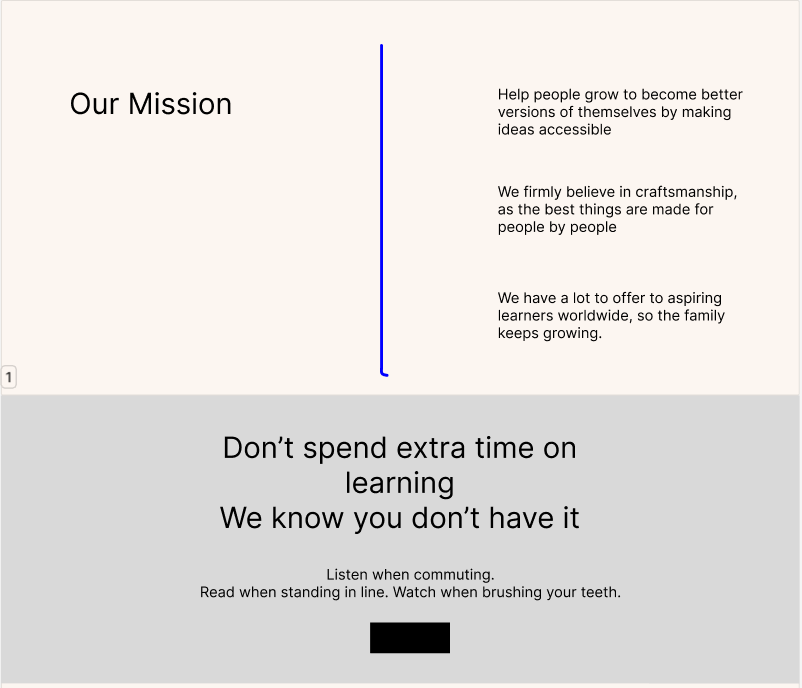
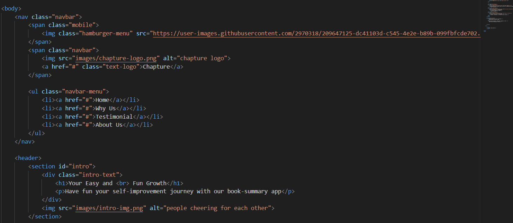
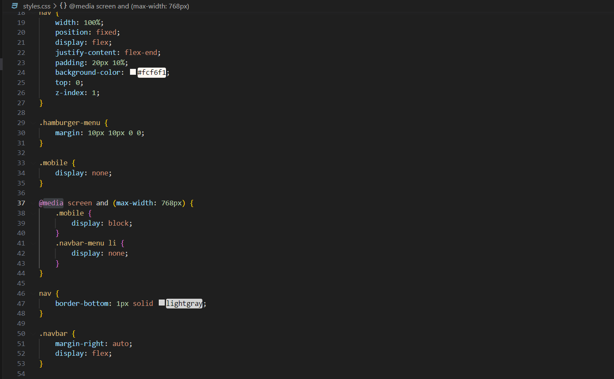
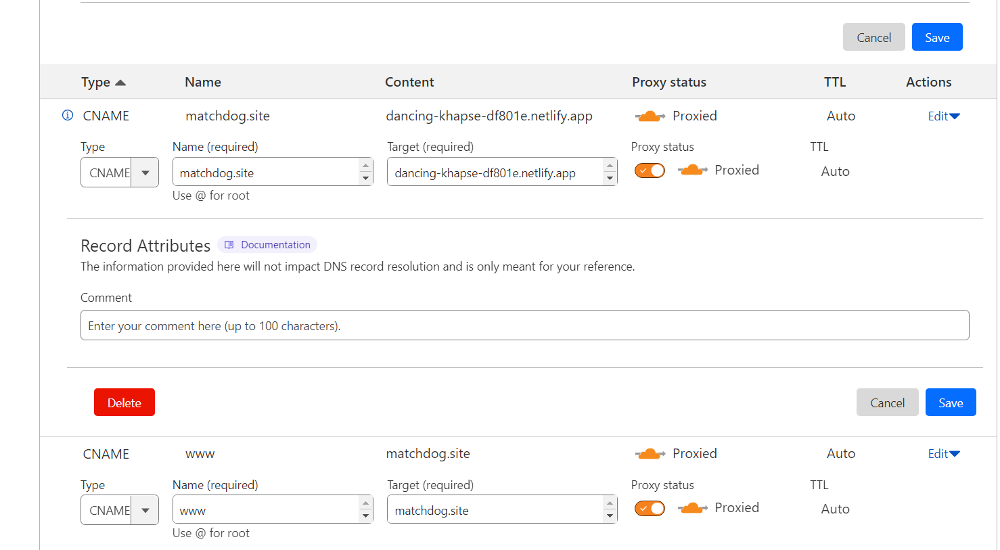
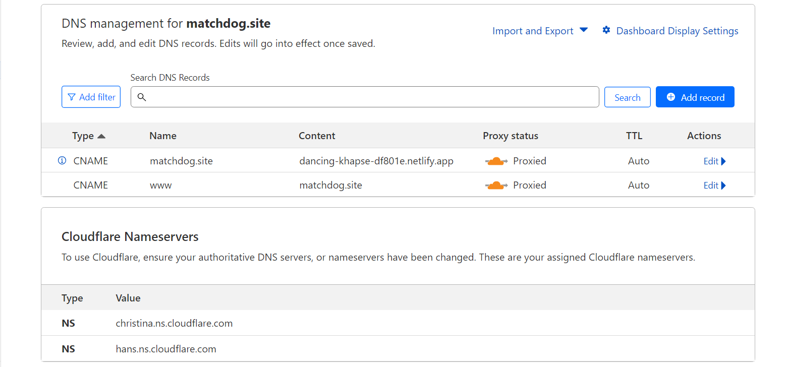

# Welcome to my 5th Week Project!

A website specifically dedicated to all book lovers with a lot of "to-read" lists that remain untouched. 
What is it? You don't have the time?
Rest assured. We know.
Introducing Chapture, a book summary app that will assist you on your literary journey in waaay shorter time.

Go to [matchdog.site](https://matchdog.site) now, or check out the development process below.
Have fun reading peeps!

# Development Process
This section will document all the development stages of creating the website: design choices, considerations, development stages, etc.
Side note: this website was built using HTML and CSS without any framework or Javascript.

# Design Choices and Idea Generation
This app is inspired by an app that I used frequently on a daily basis called Headway. It's also a book summary app with cute and colorful illustrations to heighten the reading journey with shorter time frame. Being a frequent user, I think it's fitting that I used this app as inspiration for the project this time. 

## Content Creation Process:
1. The content for the Company Profile section was developed by outlining the desired information and points to be covered.
2. Utilizing ChatGPT, paragraphs were generated to enhance and refine the written content.
3. Once the content was finalized, brainstorming sessions were conducted to come up with suitable template ideas that would beautifully showcase the content.

## Design Process:
1. The design process involved using Canva to create visually appealing templates that complemented the written content.
2. The provided image (see below) offers a glimpse into the design phase.

## HTML
1. When developing the website, HTML semantic markup was used throughout: header, nav, main, section, article, etc.
2. As best as I could, appropriate tags were also used, such as images, links, and other media elements. 
Hopefully by using this approach, accessibility and maintainability are improved on the website. 

## CSS
1. Media queries were utilized to adjust the styling and layout based on the user's device or screen width
2. Most of the structures used flexbox and grid layouts were employed to create flexible and responsive designs across mobile, tablet, and desktop.
3. A little of CSS transitions and animations were implemented to add subtle and engaging visual effects.

## Deployment
1. The website was deployed using Netlify, with a custom domain from Niagahoster.
2. To ensure seamless integration between Github and Netlify, connect your Netlify account with Github, and choose to deploy from your Github repository. This is done to ensure so that Netlify will automatically initiate deployments whenever there are any changes in your GitHub repository.
2. Cloudflare, a content delivery network (CDN), was employed to optimize the website's performance and provide enhanced security.
3. I used a domain that I've already bought and set up to another website last week. Therefore, what's left is only redirecting it to a different website.
4. It can be done by changing the target field to a different website and deleting the old one. I also used CNAME type because it is easier for Netlify.

5. Afterwards add another record with CNAME type, and fill the name field with www and target it to the custom domain website.
6. Next, in Netlify, delete the used of custom domain on the old website, and click "Add Domain" on your new website in the domain settings menu.
7. Follow the instruction to add the custom domain. The finished result will look like this.

8. Wait for a few minutes, and voila!

